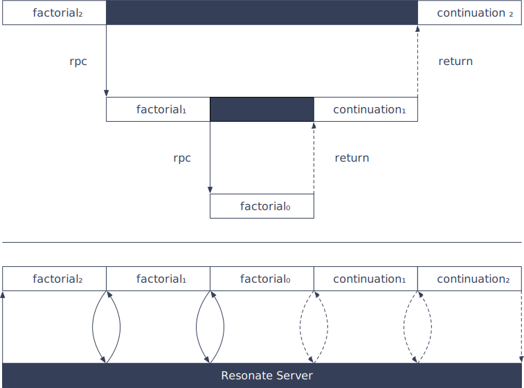

# @resonatehq/gcp

`@resonatehq/gcp` is the official binding to deploy Distributed Async Await, Resonate's durable execution framework, to [Google Cloud Functions](https://cloud.google.com/functions). Run long-running, stateful applications on short-lived, stateless infrastructure.

**Examples:**

- [Durable Countdown]()
- [Durable, Recursive Research Agent]()

## Architecture

When the Durable Function awaits a pending Durable Promise (for example on `yield* context.rpc()` or `context.sleep`), the Google Function **terminates**. When the Durable Promise completes, the Resonate Server resumes the Durable Function by invoking the Google Function again.


```ts
function* factorial(context: Context, n: number): Generator {
  if (n <= 0)  { 
    return 1;
  }
  else {
    return n * (yield* context.rpc(factorial, n - 1));
  }
}
```

Illustration of executing `factorial(2)` on Google Cloud Functions:



## Quick Start

```bash
npm install @resonatehq/gcp
```

## Quick Start

```bash
npm install @resonatehq/aws
```

See [Google Cloud Functions documentation](https://cloud.google.com/functions/docs) to learn how to develop and deploy Google Cloud Functions and see Resonate's Google Cloud Functions for a step by step tutorial:

- [Durable Countdown](https://github.com/resonatehq-examples/example-countdown-gcp-ts)
- [Durable, Recursive Research Agent](https://github.com/resonatehq-examples/example-openai-deep-research-agent-gcp-ts)
